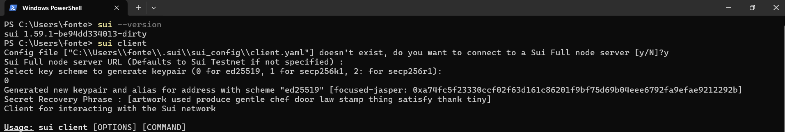

# 📘 Guia Completo de Comandos SUI

## 🔧 Comandos de Configuração

Após você conferir sua versão, qualquer comando que você for utilizar ele vai basicamente pedir para você configurar o client.



Nessa sequência mostrada na imagem, o SUI irá:
1. **Gerar uma nova carteira** automaticamente
2. **Criar as keypairs** necessárias
3. **Utilizar a keypair 0** (que é a mais indicada e padrão)
4. **Configurar o ambiente** de rede

Seria basicamente 

### `sui client new-env`
Cria um novo ambiente de rede.

```bash
sui client new-env --alias <nome> --rpc <url-rpc>
```

**Exemplos:**
```bash
# DevNet
sui client new-env --alias devnet --rpc https://fullnode.devnet.sui.io:443

# TestNet
sui client new-env --alias testnet --rpc https://fullnode.testnet.sui.io:443

# MainNet
sui client new-env --alias mainnet --rpc https://fullnode.mainnet.sui.io:443
```

### `sui client envs`
Lista todos os ambientes configurados.

```bash
sui client envs
```

**Saída esperada:**
```
╭─────────┬─────────────────────────────────────┬────────╮
│ alias   │ url                                 │ active │
├─────────┼─────────────────────────────────────┼────────┤
│ devnet  │ https://fullnode.devnet.sui.io:443  │ *      │
│ testnet │ https://fullnode.testnet.sui.io:443 │        │
╰─────────┴─────────────────────────────────────┴────────╯
```

### `sui client switch`
Alterna entre ambientes.

```bash
sui client switch --env <nome-ambiente>
```

**Exemplo:**
```bash
sui client switch --env devnet
```

## 💰 Comandos de Carteira

### `sui client active-address`
Mostra o endereço ativo atual.

```bash
sui client active-address
```

**Saída esperada:**
```
0x1234567890abcdef1234567890abcdef12345678
```

### `sui client balance`
Exibe o saldo da carteira ativa.

```bash
sui client balance
```

**Saída esperada:**
```
╭────────────────────────────────────────╮
│ Balance of coins owned by this address │
├────────────────────────────────────────┤
│ ╭──────────────────────────────────────────────────────────────────────╮ │
│ │ coin  balance (raw)  balance (display)  coin type                     │ │
│ ├──────────────────────────────────────────────────────────────────────┤ │
│ │ SUI   1000000000    1.00 SUI           0x2::sui::SUI                  │ │
│ ╰──────────────────────────────────────────────────────────────────────╯ │
╰────────────────────────────────────────╯
```

### `sui client gas`
Lista objetos de gás disponíveis.

```bash
sui client gas
```

**Saída esperada:**
```
╭────────────────────────────────────────────────────────────────────╮
│ gasCoinId                          │ gasBalance │ suiBalance       │
├────────────────────────────────────────────────────────────────────┤
│ 0x123...abc                        │ 1000000000 │ 1000000000       │
╰────────────────────────────────────────────────────────────────────╯
```

### `sui client faucet`
Solicita tokens de teste (apenas redes de teste).

```bash
sui client faucet
```

**⚠️ Importante**: 
- Funciona apenas em DevNet e TestNet
- Limitado a uma solicitação por tempo
- Fornece tokens SUI para testes

## 🏗️ Comandos Move

### `sui move new`
Cria um novo projeto Move.

```bash
sui move new <nome-do-projeto>
```

**Exemplo:**
```bash
sui move new meu_primeiro_contrato
```

**Estrutura criada:**
```
meu_primeiro_contrato/
├── Move.toml
├── sources/
│   └── (seus arquivos .move aqui)
└── tests/
    └── (seus testes aqui)
```

### `sui move build`
Compila o projeto Move.

```bash
cd <nome-do-projeto>
sui move build
```

### `sui move test`
Executa os testes do projeto.

```bash
sui move test
```

## 🔍 Comandos de Consulta

### `sui client object`
Consulta informações sobre um objeto específico.

```bash
sui client object <object-id>
```

### `sui client ptb`
Executa um bloco de transação programável.

```bash
sui client ptb --help
```

## 📊 Comandos de Monitoramento

### `sui client active-env`
Mostra o ambiente ativo atual.

```bash
sui client active-env
```

### `sui client addresses`
Lista todos os endereços da carteira.

```bash
sui client addresses
```

## 🔐 Comandos de Segurança

### `sui keytool`
Gerencia chaves criptográficas.

```bash
sui keytool --help
```

### `sui client new-address`
Gera um novo endereço.

```bash
sui client new-address ed25519
```

---

## � Recursos Avançados

⚠️ **ATENÇÃO**: Os comandos desta seção manipulam dados sensíveis. **NUNCA** compartilhe suas chaves privadas ou mnemônicos!

### Exportar Chave Privada
```bash
sui keytool export --key-identity <endereço>
```

**Exemplo:**
```bash
sui keytool export --key-identity <SUA-CARTEIRA>
```

**⚠️ CUIDADOS EXTREMOS:**
- Execute apenas em ambiente seguro
- **NUNCA** compartilhe a saída deste comando
- **NUNCA** poste em fóruns, Discord, ou redes sociais
- Considere usar apenas para backup seguro

### Exportar Mnemônico (Seed Phrase)
```bash
sui keytool export --key-identity <endereço> mnemonic
```

**Exemplo:**
```bash
sui keytool export --key-identity 0xa74fc5f23330ccf02f63d161c86201f9bf75d69b04eee6792fa9efae9212292b mnemonic
```

**🚨 SEGURANÇA CRÍTICA:**
- Armazene em local físico seguro
- **JAMAIS** digite em sites ou aplicativos suspeitos
- **NUNCA** tire screenshot ou foto
- Considere usar papel e caneta para backup

### Verificar Seed Phrase
Para verificar se sua seed phrase está correta, você pode:

1. **Exportar a seed phrase atual:**
```bash
sui keytool export --key-identity <seu-endereço> mnemonic
```

2. **Verificar o endereço gerado pela seed phrase:**
```bash
# Importe temporariamente em um alias de teste
sui keytool import "<sua-seed-phrase>" ed25519 --alias teste-verificacao

# Veja o endereço gerado
sui keytool list

# Remova o alias de teste se desejar
```

3. **Listar todas as carteiras para comparar:**
```bash
sui keytool list
```

**Saída esperada do `sui keytool list`:**
```
╭──────────────────────────────────────────────────────────────────────────────────────╮
│ alias    │ address                                                │ key scheme │ flag │
├──────────────────────────────────────────────────────────────────────────────────────┤
│ active   │ 0xa74fc5f23330ccf02f63d161c86201f9bf75d69b04eee6792fa9efae9212292b │ ed25519    │ 0    │
╰──────────────────────────────────────────────────────────────────────────────────────╯
```

### Importar Carteira Existente

**Por mnemônico (seed phrase):**
```bash
sui keytool import "<sua-seed-phrase>" ed25519
```

**Por chave privada Bech32 (suiprivkey):**
```bash
sui keytool import "<suiprivkey...>" ed25519
```

**Com alias personalizado:**
```bash
sui keytool import "<sua-seed-phrase>" ed25519 --alias minha-carteira
```

**Exemplos:**
```bash
# Importar com mnemônico de 12 palavras
sui keytool import "word1 word2 word3 word4 word5 word6 word7 word8 word9 word10 word11 word12" ed25519

# Importar com chave privada Bech32
sui keytool import "suiprivkey1q..." ed25519

# Importar com alias
sui keytool import "word1 word2..." ed25519 --alias carteira-principal
```

**⚠️ Importante:**
- Suporta mnemônicos de 12, 15, 18, 21 ou 24 palavras
- Para chaves privadas, use formato Bech32 iniciando com "suiprivkey"
- Use aspas duplas para proteger a entrada
- O alias é opcional - se não fornecido, será gerado automaticamente

### Ver Informações da Chave
```bash
sui keytool list
```

### Gerar Nova Keypair
```bash
sui keytool generate ed25519
```

### Backup Seguro da Configuração
```bash
# Fazer backup do diretório de configuração
# Windows PowerShell:
Copy-Item -Recurse ~/.sui ~/.sui_backup_$(Get-Date -Format "yyyy-MM-dd")
```

**📋 Checklist de Segurança:**
- [ ] Nunca compartilhar chaves privadas
- [ ] Fazer backup em local seguro offline
- [ ] Verificar sempre o ambiente ativo antes de transações
- [ ] Usar quantidades pequenas para testes
- [ ] Manter software atualizado

---

## �💡 Dicas Importantes

1. **Sempre verifique o ambiente ativo** antes de executar comandos
2. **Use DevNet para desenvolvimento** e testes
3. **Mantenha suas chaves privadas seguras**
4. **Faça backup das suas configurações**

## 🚨 Comandos de Emergência

```bash
# Resetar configuração (cuidado!)
rm -rf ~/.sui

# Verificar status da rede
sui client call --help
```